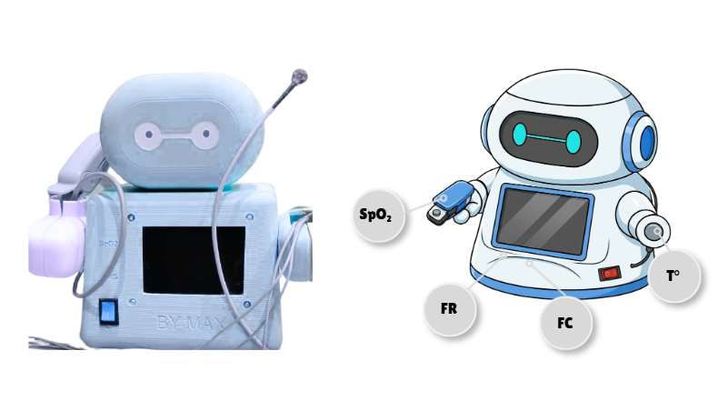
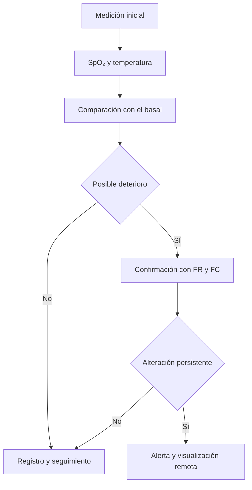

# BYMAX

### Sistema de monitoreo y detección temprana de deterioro respiratorio

BYMAX es un prototipo biomédico para el seguimiento domiciliario de personas mayores de 50 años con infecciones respiratorias agudas. Integra mediciones fisiológicas y ambientales, analiza la evolución de cada paciente respecto de su propio estado basal y emite alertas cuando detecta una tendencia persistente de deterioro.

> **Proyecto académico · Instrumentación Biomédica · 2026-I**  
> **Periodo de desarrollo:** 23 de marzo – 10 de julio de 2026

---

## Problema

En zonas con acceso limitado a establecimientos de salud, como algunas comunidades de Loreto, el seguimiento periódico de pacientes con infecciones respiratorias puede ser difícil. Además, una medición aislada o un umbral poblacional fijo no siempre representa adecuadamente el estado habitual de una persona.

BYMAX propone un monitoreo domiciliario orientado a reconocer **cambios individuales y sostenidos en el tiempo**, facilitando la identificación temprana de un posible deterioro y el seguimiento remoto por parte del personal de salud.

## Propuesta de valor

- Compara cada medición con el **basal individual del paciente**.
- Analiza la **tendencia temporal**, no solo valores aislados.
- Integra SpO₂, temperatura corporal, frecuencia respiratoria y frecuencia cardiaca.
- Registra temperatura y humedad ambiental para contextualizar las mediciones.
- Confirma la persistencia de las alteraciones antes de generar una alerta.
- Procesa la información localmente mediante un ESP32, sin depender de conexión continua a internet.
- Permite visualizar el historial y las alertas desde una aplicación móvil.

  

## Funcionamiento general

El sistema realiza mediciones seriadas —planteadas inicialmente tres veces al día— y conserva el historial del paciente. Cuando encuentra una variación relevante en SpO₂ o temperatura, activa la evaluación complementaria de frecuencia respiratoria y frecuencia cardiaca. La alerta se genera únicamente si la alteración persiste en mediciones consecutivas.

## Variables monitoreadas

| Variable | Abreviatura | Función |
|---|---:|---|
| Saturación periférica de oxígeno | SpO₂ | Seguimiento de la oxigenación |
| Temperatura corporal | T° | Detección de variaciones térmicas |
| Frecuencia respiratoria | FR | Confirmación de posible deterioro respiratorio |
| Frecuencia cardiaca | FC | Evaluación complementaria del estado fisiológico |
| Temperatura ambiental | — | Corrección y contextualización de la temperatura corporal |
| Humedad ambiental | — | Registro de las condiciones del entorno |

## Niveles de seguimiento del prototipo

| Nivel | Comportamiento del sistema |
|---|---|
| Seguimiento habitual | Registra la medición y mantiene el monitoreo programado. |
| Cambio por confirmar | Detecta variaciones respecto del basal y habilita FR y FC. |
| Alerta | Identifica una alteración persistente en mediciones consecutivas y genera una notificación. |

> Los criterios del prototipo son experimentales y requieren validación técnica y clínica antes de cualquier aplicación asistencial.

## Arquitectura del sistema

### Hardware

| Componente | Función principal |
|---|---|
| HealthyPi 5 | Plataforma para la adquisición de señales fisiológicas |
| ESP32 | Procesamiento local, control del sistema y comunicación |
| PCB personalizada | Integración electrónica del prototipo |
| AFE4400 | Adquisición de fotopletismografía y estimación de SpO₂ |
| MAX30205 | Medición de temperatura corporal |
| MAX30001 | Adquisición de ECG y estimación de FC/FR |
| AHT10 | Medición de temperatura y humedad ambiental |
| LED RGB y buzzer | Indicadores visuales y sonoros |
| Batería de ion-litio, TP4056 y MT3608 | Alimentación, carga, protección y regulación de voltaje |

### Software

- Firmware para adquisición y procesamiento de señales.
- Algoritmo de comparación con el basal individual.
- Evaluación de tendencias y persistencia temporal.
- Aplicación móvil para consulta del historial y visualización remota.
- Comunicación entre el módulo de adquisición, el microcontrolador y la interfaz.

## Flujo de uso

1. Se registra una primera medición válida como referencia basal del paciente.
2. El sistema adquiere SpO₂ y temperatura corporal junto con las variables ambientales.
3. Las nuevas mediciones se comparan con el historial reciente y el basal individual.
4. Si se detecta una variación relevante, se habilita la adquisición de FR y FC.
5. La lógica temporal verifica si la alteración persiste.
6. Si se confirma la tendencia de deterioro, se activa una alerta y el evento queda disponible en la aplicación.

## Evidencias del prototipo

- [Video de funcionamiento](https://drive.google.com/file/d/1a_ZO1OgWV5ADfsBj1GxcAIZugC10gRBI/view)
- [Galería de imágenes del prototipo](https://drive.google.com/drive/folders/15M94ReTyrBcg1arOqK-xHEU5vHh6X_ox)
- [Documentación del proyecto](https://drive.google.com/drive/folders/1NA2VmiZQueapfEnNGDpKLwhe_pRA7g7W)

> Si el repositorio será público, se recomienda copiar las evidencias autorizadas a una carpeta `media/` y reemplazar los enlaces de Drive por rutas relativas.

## Estado del proyecto

- [x] Definición del problema y de la población objetivo.
- [x] Selección de variables fisiológicas y ambientales.
- [x] Diseño de la arquitectura electrónica.
- [x] Integración del sistema de adquisición.
- [x] Desarrollo de la lógica de comparación con basal individual.
- [x] Implementación de alertas visuales y sonoras.
- [x] Desarrollo de una interfaz para visualización remota.
- [x] Construcción de un prototipo funcional.
- [ ] Validación con una muestra representativa de usuarios.
- [ ] Evaluación clínica y regulatoria.
- [ ] Optimización para una futura versión portátil.

## Alcance y seguridad

BYMAX es un **prototipo académico de investigación**. No es un dispositivo médico certificado, no establece diagnósticos y no reemplaza la evaluación de un profesional de salud ni los servicios de emergencia. Antes de una aplicación clínica se requieren pruebas de desempeño, usabilidad, seguridad eléctrica, gestión de riesgos y validación clínica.

---

  <strong>BYMAX · Monitoreo personalizado para una detección más temprana</strong>

